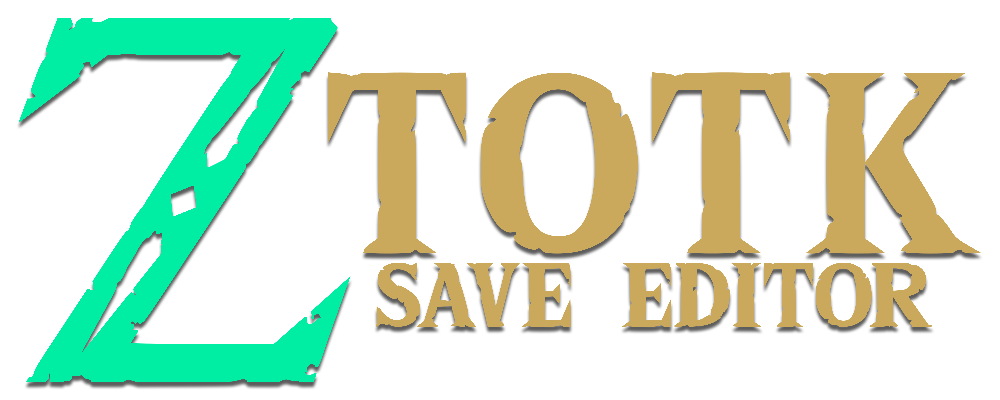

# ToTK Save Editor

<p align="center">
  
</p>

**ToTK Save Editor** is a native Nintendo Switch homebrew application for editing *The Legend of Zelda: Tears of the Kingdom* saves. It provides a controller-first interface for choosing an exported save, adjusting player stats, managing inventory and horses, and importing Autobuild blueprints from either the online HyruleWorks catalog or local `.cai` files.

The editor works with save data exported by a homebrew save manager; it does not modify Nintendo Switch system storage directly. All editing takes place on the exported files on the SD card, so you remain in control of when edited data is imported back into the game.

> [!WARNING]
> Back up your save before editing it. This is an unofficial community project, and save editing is always performed at your own risk. Use only with your own save data and respect Nintendo's terms and applicable laws.

## Features

- Native Switch UI built with Borealis, including controller and touch support.
- Save-slot picker with screenshot, in-game location name, save type/date, player stats, and completion snapshot.
- Player-stat, pouch-capacity, position, and map-pin editing.
- Inventory management for shields, weapons, bows, armor, materials, meals, Zonai devices, key items, and horses.
- Item-specific editing for durability, modifiers, fusions, food effects, armor upgrades/dyes, and horse data.
- Autobuild Favorites and History viewer, online HyruleWorks browser, and local `.cai` importer.
- Built-in save validation, game-limit clamping, icon atlas, and location-name data.


### Install and prepare a save

1. Copy `build-switch/totk_save_editor.nro` to `sdmc:/switch/totk-save-editor/`.
2. Use a save manager such as [JKSV](https://github.com/J-D-K/JKSV) to export your *Tears of the Kingdom* save.
3. Place each exported save folder under `sdmc:/switch/totk-save-editor/saves/slot_00/`, `slot_01/`, and so on. A slot needs at least `progress.sav`; including `caption.sav` enables the screenshot, save date, save type, and location display.

   ```text
   sdmc:/switch/totk-save-editor/saves/slot_00/progress.sav
   sdmc:/switch/totk-save-editor/saves/slot_00/caption.sav
   ```

4. Launch ToTK Save Editor from the Homebrew Menu, make your changes, then press **Y** in the editor to write the selected slot's `progress.sav`.
5. Exit the app and use your save manager to restore that edited export to the game.

Keep the original export separately until you have confirmed the edited save loads correctly in-game.

## Using ToTK Save Editor

### Controls used throughout the editor

| Control | Action |
| --- | --- |
| **D-pad / Left Stick** | Move the selection or scroll a list/grid. |
| **A** | Open, select, edit, add, or confirm the focused item. |
| **B** | Go back or cancel. |
| **L / R** | Move to the previous/next main tab; tab navigation wraps around. |
| **X** | Add an inventory item, or open the local Autobuild import browser on the Autobuild tab. |
| **Y** | Write the current save to `progress.sav`. |

Edits live in memory until you press **Y**. You can move between tabs before saving, but leaving the editor with **B** does not write changes automatically.

### 1. Save picker

The first screen lists the exports found in `saves/`. Select a row with **A** to load it.

The focused save's detail panel shows its screenshot, real in-game location name when available, date, manual/autosave state, hearts, stamina, playtime, rupees, battery cells, and the current Korok, shrine, and lightroot totals. This makes it easier to identify the correct export before making changes.

After a save loads, the editor opens on **Stats**. Returning to the picker refreshes the displayed data for the save you edited.

### 2. Stats

Use this tab to edit the player-wide values below:

- Rupees.
- Maximum hearts, stamina, and Energy Well/battery capacity.
- Pony Points.
- Weapon, bow, and shield pouch capacities.
- Player position coordinates (`X`, `Y`, and `Z`).
- Map pins: the screen shows the current count and includes **Remove All Map Pins**.

The editor shows the game version and playtime as reference information. Numeric fields and choices are constrained to supported ranges to reduce invalid values. Leaving the Stats tab applies its current controls to the loaded save; press **Y** when ready to write them to disk.

### 3. Shields, Weapons, and Bows

These three equipment tabs work the same way. The counter at the top shows used slots versus the current pouch capacity. Focus an item to see its name, details, and attached fusion; press **A** to open its editor.

In an equipment item's editor you can:

- Set durability.
- Choose a modifier and modifier value.
- Choose or replace the fused material.
- Delete the item after confirmation.

To add equipment, either select the **+** tile or press **X**. Choose an item from the icon grid; use its search control to narrow the list, then press **A** to add the chosen item. The editor will not add an item if that pouch is full.

### 4. Armors

The armor grid shows the pieces currently held. Press **A** on a piece to change its upgrade level when that armor supports upgrades, and select a dye color for dyeable armor. Non-dyeable pieces are identified in the editor. Use the **+** tile or **X** to add armor, and use **Delete Item** in a piece's editor to remove it.

### 5. Materials

Materials are stackable inventory entries. Press **A** on a material to set its quantity, or delete the stack. Add a new material with the **+** tile or **X** and select it from the searchable item grid.

### 6. Food

Food entries can be added, removed, and edited. In addition to quantity, a food editor lets you set:

- Effect type, level, and duration.
- Hearts healed.
- Sale price.

These values are clamped to the editor's supported game ranges. Add meals with the **+** tile or **X**, then select the meal in the item picker.

### 7. Zonai Devices

This tab manages your stackable Zonai-device inventory. Select an existing stack with **A** to change its quantity or delete it. Use **+** or **X** to choose and add another device.

### 8. Key Items

Use this tab for stackable key-item entries. Select an entry to change its quantity or remove it; use **+** or **X** to add an available key item.

### 9. Horses

The Horses tab lists the horses stored in the save. Select a horse with **A** to open a detailed editor, where you can change:

- Name and bond.
- Strength, speed, stamina, and pull.
- Horse type, coat/color type, and foot type.
- Mane, saddle, reins, stable-portrait pattern, eye color, and portrait color channels.

Use **+** or **X** to add a horse and **Delete Item** to remove one. As with other categories, the displayed capacity controls how many entries can be held.

### 10. Autobuild

The Autobuild tab displays the save's **30 Favorites slots** and its unfavorited History drafts. Each card can use the game cache's thumbnail or a locally stored preview image when available.

#### Browse HyruleWorks online

1. Select **Browse HyruleWorks Catalog** and press **A**.
2. In the catalog, use **X** to search, **L/R** to move between result pages, and **A** to open a build.
3. The build detail screen shows the build name, creator, description, and every available preview image. Use **L/R** there to cycle images.
4. Press **A** to download and validate the blueprint.
5. Select one of the 30 Favorites slots to overwrite it, or choose **New History Entry** to add it to History. An occupied Favorite is explicitly marked before you choose it.
6. The import is saved to the loaded export's Autobuild data. Press **Y** on the main editor when you also need to write the rest of the save.

An internet connection is required only for catalog browsing, images, and downloading online blueprints. Builds without an importable blueprint are excluded from the catalog list.

#### Import a local `.cai` blueprint

1. Copy one or more `.cai` files anywhere on the Switch SD card.
2. From the Autobuild tab, press **X** for **Import from SD**.
3. Browse folders, select a `.cai` file, and let the editor validate it.
4. Choose a Favorite slot or **New History Entry**, as with an online import.

Local imports require no internet connection. The editor writes the blueprint payload and related camera data needed by the save; it does not promise to refresh Nintendo's in-game render cache, so a reused in-game tile can temporarily show an older thumbnail even though the imported build data is present.

> [!CAUTION]
> #### Notes regarding Autobuild

If you care about the icon being updated, then after import, go into the game, and if there isn't already the max amount of items on the build, then add something like a flower, and it will register as a new build that you can save or use from history.

Prior to importing any autobuilds, you should make a backup of both the savegame and cache files using JKSV. The way they get imported into the game isn't 100% stable when it comes to the icons and `.cai` files. Unfortunately the way it's designed, it isn't just a simple replace one build with another. One thing believed to have completely broken the autobuilds and icon updates was adding an object that wasn't normally obtainable (Zelda's cutscene torch), so avoiding those types of items is advised. Again, back up both cache and save with JKSV prior to any imports to be safe.

### 11. About

The About tab shows the version of the app and recognizes the save-format researchers, data sources, community resources, libraries, and port author that make the project possible. Full linked credits are below.

## Credits

| Credit | Contribution |
| --- | --- |
| [Marc Robledo](https://github.com/marcrobledo/savegame-editors/tree/master/zelda-totk) | Original web editor, save parsing/writing reference, hash database, item icons, and UI assets. |
| [MacSpazzy](https://github.com/MacSpazzy) | Hash-cracking and save research; original Autobuilder blueprint viewer/editor work. |
| [MrCheeze](https://github.com/MrCheeze) | Hash-cracking and save research. |
| [Karlos007](https://github.com/Karlos007) | Hash-cracking/save research and horse data. |
| [JonJaded](https://github.com/JonJaded) and [Ozymandias07](https://github.com/Ozymandias07) | Horse data research. |
| Echocolat, Exincracci, HylianLZ, ApacheThunder, Phil, and savage13 | Additional item/hash research reflected in the original editor's acknowledgements. |
| [xiyuesaves](https://github.com/xiyuesaves) | Filterable item-dropdown contribution to the reference editor. |
| [zeldamods / objmap-totk](https://github.com/zeldamods/objmap-totk) | Extracted game message data used to map internal location identifiers to real in-game names. |
| [HyruleWorks](https://www.hyruleworks.com/) | Community catalog of Autobuild blueprints used by the in-app online browser. |
| [Borealis](https://github.com/xfangfang/borealis) | Nintendo Switch-native UI framework, maintained by xfangfang, natinusala, and contributors. |
| [devkitPro](https://devkitpro.org/) and [libnx](https://github.com/switchbrew/libnx) | Nintendo Switch homebrew toolchain and system library. |
| [JKSV](https://github.com/J-D-K/JKSV) | Recommended save-manager workflow for exporting and restoring saves. |
| [electrotamp](https://github.com/electrotamp) | ToTK Save Editor Switch homebrew port. |

See [ATTRIBUTION.md](ATTRIBUTION.md) for the source attribution notes. Item icons and related reference assets remain subject to the original project's licensing and should not be redistributed separately without respecting those terms.
